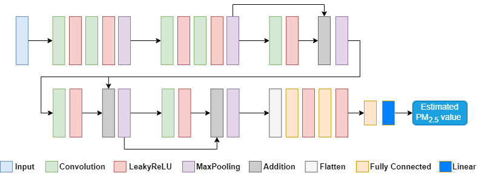

# Explainable_air_pollution_classification
Experiment Environment
=

Python:3.8

opendatasets

matplotlib

seaborn

statsmodels

pandas

numpy>=1.19

keras

tensorflow==2.4

Lime

About Dataset
=

This dataset contains images of Air Pollution for different cities in India and Nepal. The dataset is divided into two folders: Combined_Dataset and Country_wise_Dataset.

Total number of image dataset: 12,240 

Image Size: 224*224 

**Cities of India**

1. ITO, Delhi
2. Dimapur, Nagaland
3. Spice Garden, Bengaluru
4. Knowledge  Park III, Greater Noida
5. New Ind Town, Faridabad
6. Borivali East, Mumbai
7. Oragadam, Tamil Nadu

**City of Nepal**
1. Biratnagar

**Combined dataset:**

The combined dataset folder contains two subfolders.
1. All_img: This subfolder contains all the collected images from all AQI classes.
2. IND_and_NEP: This subfolder contains six different subfolders representing six different classes of AQI.

The csv file in this folder contains all the data and its parameters.
It is labeled as

Location, Filename, Year, Month, Day, Hour, AQI, PM2.5, PM10, O3, CO, SO2, NO2, and AQI_Class

**Country_wise_Dataset:**

This folder contains two subfolders representing the countries from which the dataset was collected.

1. **India:**
This subfolder contains the subfolder representing the names of all cities from where data were collected.
Each subfolder of cities contains folders representing the data collected for each respective AQI class, as well as a csv file.
which contains the details of each image, like we mentioned above.
Such as,

Location, Filename, Year, Month, Day, Hour, AQI, PM2.5, PM10, O3, CO, SO2, NO2, and AQI_Class

2. **Nepal:**
We managed to collect the image dataset from Nepal.
This subfolder contains the subfolder representing the name of the city from where data were collected.
This subfolder of the city contains folders representing the data collected for each AQI class and also a csv file.
which contains the details of each image, like we mentioned above.
Such as,

Location, Filename, Year, Month, Day, Hour, AQI, PM2.5, PM10, O3, CO, SO2, NO2, and AQI_Class
****Instructions on how to use the AQI image dataset:****

1. Download the dataset from Kaggle and extract the zip file to a folder of your choice. Please Visit this link to download the Dataset:
https://doi.org/10.34740/KAGGLE/DS/3152196

https://www.kaggle.com/datasets/adarshrouniyar/air-pollution-image-dataset-from-india-and-nepal

2. The dataset is divided into two folders: the Combined_Dataset and Country_wise_Dataset. 
Each folder contains subfolders and CSV files.

3. To access the images in the Combined_Dataset folder, go to the folder corresponding to the class of AQI you are interested in.
For example, if you are interested in the 'Unhealthy' class, go to the 'Unhealthy' folder. Inside this folder,
You will find a number of images representing different cities.

4. To access the data in the Country_wise_Dataset folder, go to the folder of the country you are interested in, either India or Nepal.
Inside each country folder, you will find subfolders representing different cities.
Each city folder contains a CSV file that lists the AQI values and other parameters for the city.

5. You can use this dataset to train machine learning models to predict AQI for different cities.
You can also use it for research on air pollution in different cities. For reference to use this dataset you can visit this link: 

https://www.kaggle.com/code/momo88/vgg16-translearning-for-image-based-aqi-estimation

For the explainable AI we have implemented LIME Usability and quality explanations for various black-model outputs are two of LIME’s primary selling factors. Figure below depicts a proposed model that takes in input and produces some type of prediction or classification. LIME perturbed the proposed model with the same input in order to determine which features or superpixels had the greatest influence on prediction. LIME then creates an explanation based on this procedure to enlighten the user or developer and aid in troubleshooting if the model’s output performance is inadequate.

As for the code sample you can open this [notebook](AIX_LIME.ipynb) or [Kaggle notebook](https://www.kaggle.com/code/momo88/pm2-5-value-estimation-with-lime)

The figure below illustrates the proposed architecture of the model, and you can download the pre-trained model weight [here](LIME_20240506.best.hdf5).

The following samples show the explained output images from LIME.

6. If you use this dataset for any purpose, please cite it as the source of the data in any publications or presentations,
resulting from the use of this dataset.

**Citation Request: You can cite our dataset as follows**

**Paper 1 --> Explainable AI Implementation**

APA:

Utomo, S., John, A., Pratap, A., Jiang, Z. S., Karthikeyan, P., & Hsiung, P. A. (2023, February). <i>AIX implementation in image-based PM2. 5 estimation: Toward an AI model for better understanding.</i> In 2023 15th International Conference on Knowledge and Smart Technology (KST) (pp. 1-6). IEEE. DOI: https://doi.org/10.1109/KST57286.2023.10086917

Bibtex:

@inproceedings{utomo2023aix,
  title={AIX implementation in image-based PM2. 5 estimation: Toward an AI model for better understanding},
  author={Utomo, Sapdo and John, A and Pratap, Ayush and Jiang, Zhi-Sheng and Karthikeyan, P and Hsiung, Pao-Ann},
  booktitle={2023 15th International Conference on Knowledge and Smart Technology (KST)},
  pages={1--6},
  year={2023},
  organization={IEEE}
}

**Paper 2 --> Efficient Model for Image-based Air Qulity Prediction**

APA:

Utomo, S., Rouniyar, A., Jiang, G. H., Chang, C. H., Tang, K. C., Hsu, H. C., & Hsiung, P. A. (2023, September). <i>Eff-AQI: An Efficient CNN-Based Model for Air Pollution Estimation: A Study Case in India.</i> In Proceedings of the 2023 ACM Conference on Information Technology for Social Good (pp. 165-172). DOI: https://doi.org/10.1145/3582515.3609531

Bibtex:

@inproceedings{utomo2023eff,
  title={Eff-AQI: An Efficient CNN-Based Model for Air Pollution Estimation: A Study Case in India},
  author={Utomo, Sapdo and Rouniyar, Adarsh and Jiang, Guo Hao and Chang, Chun Hao and Tang, Kai Chun and Hsu, Hsiu-Chun and Hsiung, Pao-Ann},
  booktitle={Proceedings of the 2023 ACM Conference on Information Technology for Social Good},
  pages={165--172},
  year={2023}
}

**Paper 3 --> Secure and Robust Federated Learning for Smart City Applications**

APA:

Utomo, S., Rouniyar, A., Hsu, H. C., & Hsiung, P. A. (2023). Federated Adversarial Training Strategies for Achieving Privacy and Security in Sustainable Smart City Applications. Future Internet, 15(11), 371. DOI: https://doi.org/10.3390/fi15110371

Bibtex:

@article{utomo2023federated,
  title={Federated Adversarial Training Strategies for Achieving Privacy and Security in Sustainable Smart City Applications},
  author={Utomo, Sapdo and Rouniyar, Adarsh and Hsu, Hsiu-Chun and Hsiung, Pao-Ann},
  journal={Future Internet},
  volume={15},
  number={11},
  pages={371},
  year={2023},
  publisher={MDPI}
}

